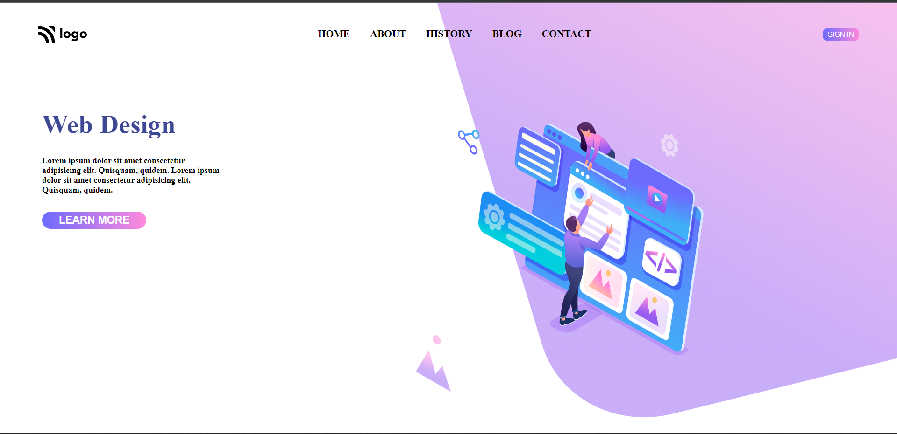

# Project 08 | HTML and CSS | Web Design Home Page 

By prajwal

---

 

---

## What I learned from this Project

- Learned lot about z-index and css positioning.
- learned to use linear gradient at btn background.
  
  ## Time required for finishing the peoject
- It takes me near about 5 hours to complete the project.